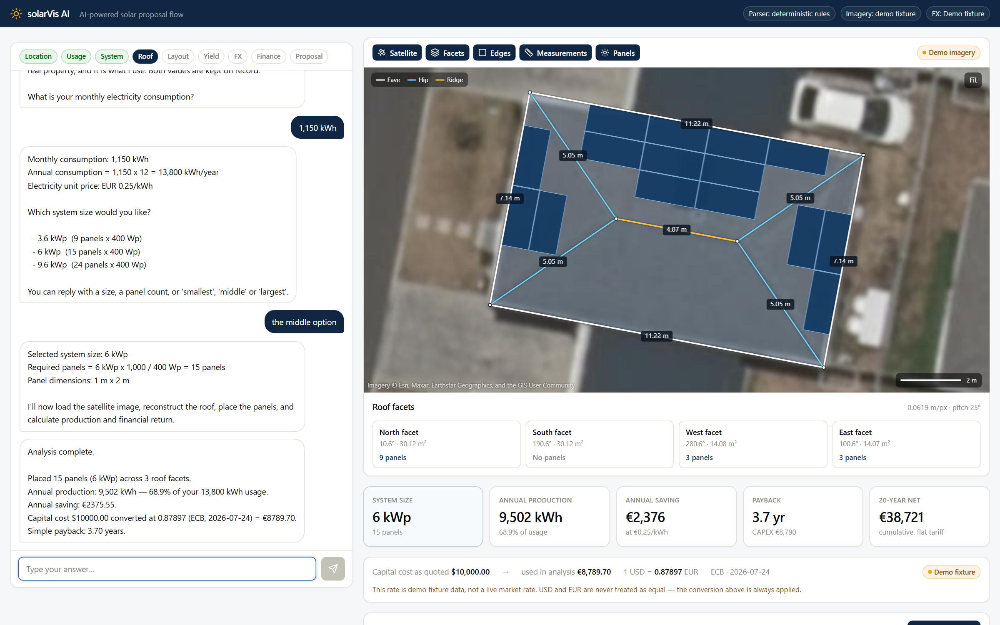
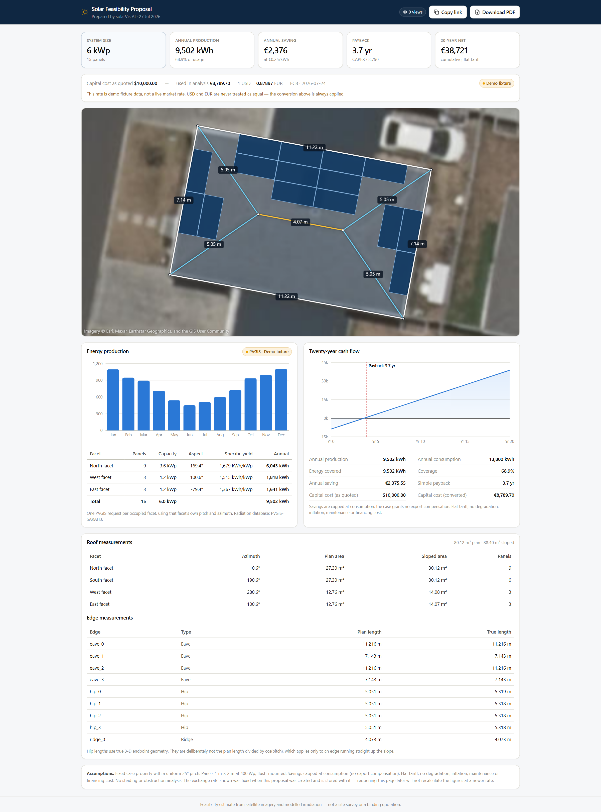

# solarVis AI — AI-Powered Solar Proposal Flow

A chat-driven solar feasibility tool. A customer gives a location and their electricity use, picks one of three system sizes, and gets a measured roof reconstruction, an optimised panel layout, facet-level production from PVGIS, currency-converted financials, and a shareable proposal with a PDF.

**Every engineering, currency and financial number is computed deterministically in the backend. The language model never produces a value that reaches the domain.**



---

## Quick start

```bash
cp .env.example .env
# Add your Google Maps API key to .env - see below for why it is required.
docker compose up --build
```

**A Google Maps Static API key is the one credential you must supply.** The
application always fetches the satellite raster over HTTP; there is no imagery
mode and no committed image standing in for one. That is deliberate: serving a
stored raster when the fetch fails is how a correct-looking roof outline ends up
drawn over the wrong picture, which is a defect this build has already had once.

Everything else runs without credentials. PVGIS is public, the exchange rate
falls back to a labelled capture, and the deterministic parser handles the whole
conversation with no model pulled.

- App → <http://localhost:3000>
- API docs → <http://localhost:8000/docs>
- Calibration tool → <http://localhost:3000/dev/roof-calibration>

Verified: both images build, the API reports healthy, and a complete proposal
(15 panels, live PVGIS, live ECB rate, a 104 KB PDF rendered by Chromium
inside the container) runs end to end. Evidence in
[`docs/implementation-status.md`](docs/implementation-status.md).

Then type any coordinate, `1,150 kWh`, and `the middle option`.

<details>
<summary>Running without Docker</summary>

```bash
# API  (Python 3.12)
cd apps/api
python -m venv .venv && ./.venv/Scripts/python -m pip install -e ".[dev,pdf]"
./.venv/Scripts/python -m playwright install chromium      # needed for PDF export
./.venv/Scripts/python -m uvicorn app.main:app --port 8000

# Web  (Node 22)
cd apps/web
npm install && npm run dev
```

The API applies its own migrations at start-up, so there is no separate
`alembic upgrade` step.

On Windows use `py -3.12` and `./.venv/Scripts/python`; on macOS/Linux use `python3` and `./.venv/bin/python`. `scripts/setup.ps1` and `scripts/setup.sh` do all of this for you.
</details>

---

## Two things worth reading before the code

### 1. The case coordinate is in the sea

The brief gives:

```
34.04658242871865, 18.46491476666948
```

That point is **open Mediterranean Sea**. Nominatim returns `Unable to geocode`. The latitude is missing its minus sign — and the brief's own page carries the error, so it is not a transcription slip downstream.

Resolved to `−34.04658242871865, 18.46491476666948` on three independent lines of evidence:

| Check | Result |
|---|---|
| Reverse geocode, negative latitude | Galway Road, Cape Town, Western Cape 7945, South Africa |
| PVGIS 5.3 at that point | HTTP 200, land, elevation 17.0 m |
| Imagery on that bounding box | The same hipped-roof estate as the brief's reference photographs — matching their roof rotation to 0.1° |

Both values are stored. The application shows what the brief said and what it actually used, and never silently substitutes one for the other. Full write-up: [`docs/location-verification.md`](docs/location-verification.md).

### 2. The site is in the southern hemisphere, which inverts the answer

The brief is written with northern-hemisphere intuition. Measured live at the resolved coordinate, 6 kWp at 25°:

| Orientation | Annual production |
|---|---|
| **North-facing** | **10,122 kWh** |
| South-facing | 6,646 kWh |

North wins by **52 %**. No optimal aspect is hardcoded anywhere — facet ranking comes from a per-facet 1 kWp PVGIS probe, so the correct answer emerges from data.

This is visible in the output. At 6 kWp the optimiser places 9 panels on the north trapezoid, then fills the two **small east and west triangles** and leaves the equally-large south trapezoid empty, because west (1,515 kWh/kWp) and east (1,367) out-produce south (1,120). An allocator ranking by area would get this wrong.

---

## What it produces

Verified end-to-end against live PVGIS and the live ECB rate:

| System | Panels | Allocation | Production | Coverage | Payback | 20-year net |
|---|---|---|---|---|---|---|
| 3.6 kWp | 9 | N 9 | 6,043 kWh | 43.8 % | 5.82 yr | €21,426 |
| 6.0 kWp | 15 | N 9 · W 3 · E 3 | 9,502 kWh | 68.9 % | 3.70 yr | €38,721 |
| 9.6 kWp | 24 | all four facets | 13,534 kWh | 98.1 % | 2.60 yr | €58,878 |

Sample PDF: [`sample-output/example-proposal.pdf`](sample-output/example-proposal.pdf) — generated by the application, not mocked up.



---

## The customer-to-proposal journey

Beyond the case brief's single-property flow, the app carries a proposal from a
named customer to a link they have opened:

```
/customers  →  new customer  →  new project for them  →  [conversational analysis]
            →  finalise: revision 1, with the customer frozen into the document
            →  preview the exact email  →  confirm  →  send
            →  they open the link  →  first viewed · last viewed · view count
            →  edit  →  revision 2; revision 1 is untouched and still resolves
```

Three properties are worth stating because they are what the code is shaped around.

**A revision is a forked project, not a new row in a versions table.** That is
how "supersede rather than edit in place" is enforced: an issued proposal is
never written to again, and `isSuperseded` is derived at read time from the
chain rather than stamped onto the older document.

**Sending is a separate act from issuing.** A failed send leaves a perfectly
valid proposal and a working public link, which is exactly the fallback the UI
offers. Confirmation is explicit and two-step: previewing, viewing the
recipient, or retrying a read can never cause a send.

**Nothing claims more than it knows.** `sent` means the provider accepted the
message. Console mode reports *"recorded locally"*, never *"sent"*. The view
count is of the proposal **page** — there is no email-open tracking anywhere,
and the UI never uses the word. See
[`known-limitations.md`](docs/known-limitations.md#customers-and-email-delivery).

### Trying the email path for real

`EMAIL_MODE=console` is the default and sends nothing. To watch a real message
arrive without an external account, run the bundled Mailpit profile:

```bash
docker compose --profile mail up -d
# then set, for the api service:
#   EMAIL_MODE=smtp  SMTP_HOST=mailpit  SMTP_PORT=1025
#   SMTP_USE_TLS=false  EMAIL_FROM=proposals@solarvis.test
# and read the inbox at http://localhost:8025
```

`EMAIL_MODE=smtp` is **refused** when `APP_ENV` is `test`, `e2e` or
`verification` — the settings fail to construct, so no automated run can send
real mail even if handed a working relay.

---

## Architecture

```
apps/web   Next.js 15 · React 19 · TypeScript strict · Tailwind 4 · React Konva · Recharts
apps/api   FastAPI · Pydantic 2 · SQLAlchemy 2 · SQLite · Shapely · Jinja2 · Playwright
fixtures/  Committed satellite, PVGIS and FX fixtures so the app runs with no credentials
docs/      Verification, geometry, assumptions, case answers, live build log
```

The browser never talks to Google, PVGIS or the FX provider. Everything is proxied through the backend, which keeps the API key server-side and — just as importantly — keeps the Konva canvas **same-origin**, so the finished layout can be exported to PNG without tainting.

### Three coordinate spaces, never conflated

This is the highest-risk area in the project, and the source of the error most likely to go unnoticed.

| Space | Role |
|---|---|
| **Source-map pixels** | The canonical 1280×1280 raster from a *verified* centre/zoom/size/scale. **Authoritative.** All calibration, edges, areas and panel geometry live here. |
| Fixture-image pixels | Display substrate only. Bridged by an explicit, persisted transform. |
| Display/viewport | Derived at render time. Never stored. |

**Metres-per-pixel comes only from Web Mercator plus the verified zoom and scale — never from the dimensions of whatever image is on screen.** At the case site that is `0.0618500 m` per source pixel.

The brief's own reference images measure roughly **3.4× the magnification** of that grid. Treating their pixels as source pixels would have inflated every length by 3.4× and every area by 11.6× — while still looking entirely plausible. They are kept as topology references only.

The committed satellite fixture is rendered on the **exact** Web Mercator bounding box that Google Static Maps `z20/scale2/640×640` covers, so the fixture→source transform is the identity and calibration carries over unchanged to live imagery.

### A-GEO-1: the planar-facet assumption

Each facet is planar with a level eave, so the in-plane direction perpendicular to the eave is the true line of maximum slope. Consequences, which hold **only** under that assumption:

- `u` (along the eave) is unforeshortened; `v` (up the slope) is foreshortened by `cos(pitch)`, and only `v`.
- `sloped_area = projected_area / cos(pitch)` for a whole facet.
- **A hip is not `projected / cos(pitch)`.** A hip runs diagonally across the slope, not up it.

On this roof, measured: a hip is **5.319 m** true against a 5.051 m plan run. The naive correction claims 5.573 m — a **4.8 % overstatement per hip**, which would compound into facet areas and panel counts. A regression test pins it.

---

## Operating modes

Every mode is surfaced in the UI, in the proposal snapshot, and in the PDF assumptions. **Fixture data is never presented as live.**

| Setting | Default | Notes |
|---|---|---|
| `FX_MODE` | `live` | Frankfurter with ECB as the explicit provider |
| `LLM_PROVIDER` | `rules` | `ollama` · `rules` · `disabled` — the full flow works in all three |
| `EMAIL_MODE` | `console` | `console` renders and logs the message and sends **nothing**; `smtp` hands it to a relay |

**PVGIS has no mode.** Every analysis makes a real HTTP call to `PVGIS_BASE_URL`,
and an analysis that cannot make one *fails* — no captured payload, no synthetic
estimate, no partial answer. The consequence is deliberate and worth stating
plainly: an offline deployment cannot complete an analysis. The test suites stay
offline by pointing that URL at a local replay server; the application does not.

Only `https://re.jrc.ec.europa.eu/api/v5_3` produces a proposal-grade
observation. Anything else — another origin, another API version, plain HTTP —
is labelled `replay` and **cannot be finalised**. `ALLOW_REPLAY_PROPOSALS` is
the sole exception, exists only so the stub-backed test harnesses can exercise
finalisation, and start-up refuses it outside a recognised test environment.

### Currency: parity is unreachable by construction

CAPEX is quoted in USD; savings accrue in EUR. Assuming parity would understate the payback period by about 12 %.

- There is **no setting** for a fixed rate, and no code path that defaults to `1.0`. A test greps the source for the usual offenders.
- Fallback is **live → cache → labelled fixture**; stale cached rates are rejected.
- The retrieval source travels with every rate and is always displayed.
- **A finalised proposal never re-reads the rate.** A test forces a different rate into the cache and asserts the stored proposal is unchanged.

### Optional local LLM

```bash
docker compose --profile ollama up -d
docker compose exec ollama ollama pull qwen3.5:2b
# then set LLM_PROVIDER=ollama in .env and restart the api service
```

The deterministic parser is step-aware and covers every phrasing the brief demonstrates — `1150`, `1,150`, `around 1150 per month`, `the middle option`, `twenty-four panels`, `eleven hundred and fifty`. Step-awareness is what makes it *safe*: the bare token `6` is 6 kWp at the system-size step and 6 kWh/month at the consumption step. `LLM_PROVIDER=rules` is a complete implementation, not a degraded one.

Model output is forced through a JSON schema, Pydantic-validated, then re-checked against the same whitelist the rules parser uses — so the model cannot reach the domain with a value the rules would have rejected. It has no field for money, production, geometry, an exchange rate, or the next workflow step, and it never sees the analysis snapshot.

### A conversation, not a wizard

You can ask a question at any step and the workflow does not move: the step stays, no value is written, and the stored analysis is byte-identical afterwards. *"How big is the roof?"* returns real measurements at the **first** step, because the roof is fixed and needs no analysis at all.

Correcting a value recalculates only what depends on it — changing your consumption leaves the roof, the layout, the modelled production and the exchange rate exactly as they were, and the untouched sections are compared byte for byte to prove it. Correcting a value on a project whose proposal has been issued forks a **revision**: the old proposal and its link never change, and finalising the revision mints a new one.

The location is the one place this build says no. There is no geocoder, so an address cannot be checked against the calibrated property; anything away from the case coordinate is refused, the case property is offered instead, and nothing is stored. Accepting it would label every figure downstream with a property the model had never seen.

Full design: [`docs/conversation.md`](docs/conversation.md).

---

## Testing

```bash
cd apps/api && ./.venv/Scripts/python -m pytest -q -m "not live"   # 1,289 tests
cd apps/api && ./.venv/Scripts/python -m ruff check app tests
cd apps/api && ./.venv/Scripts/python -m mypy app
cd apps/api && ./.venv/Scripts/python -m alembic heads              # one head expected
cd apps/web && npm run typecheck && npm run test && npm run build  # 61 tests
```

```bash
# End-to-end. Nothing to start first — the suite starts its own stacks.
cd apps/web
npx playwright test --grep "@p0"            # 87 mandatory
npx playwright test --grep-invert "@live"   # 124: deterministic + degraded + pvgis-down
npx playwright test --grep "@live"          # opt-in; needs E2E_LIVE to name a service
```

Playwright starts **three stacks**. A deterministic one on `:3100`/`:8100` where Maps, FX and the LLM are committed fixtures and PVGIS answers from a local replay server on `:8102`. A degraded one on `:3101`/`:8101` whose FX and Ollama endpoints cannot resolve. And an API-only one on `:8103` — no browser, no Next build — whose PVGIS points at a fault path that always answers 503, for the failure spec.

PVGIS and FX are called by the backend, so browser-level mocking could never reach them; stacks genuinely configured to fail are the only honest way. Each owns a temporary database and refuses to start on an occupied port rather than attaching to a stranger's server.

The degraded stack's PVGIS is *not* unreachable, and that is a deliberate change: an unreachable PVGIS now fails the analysis outright, so there would be no proposal left with which to test the FX and LLM fallbacks. The genuine-outage case has its own stack instead.

`E2E_TARGET_URL=http://127.0.0.1:3000 npx playwright test --grep "@p0"` runs the same suite against the Docker containers instead.

Live-marked tests hit real APIs and are deselected by default: `pytest -m live`.

**Exact production numbers are asserted only against fixtures.** Live PVGIS tests assert invariants and plausible ranges — including that north out-produces south at this site — because PVGIS revises its radiation datasets and pinned live kWh would fail for reasons unrelated to this code.

Integration tests run fully offline against a throwaway database: Maps, FX and the LLM on committed fixtures, and PVGIS against a local replay server started by the suite. The application always makes a real PVGIS request; the suite decides who answers it. That is what makes "a consumption change makes zero PVGIS calls" an assertable request count rather than a claim.

---

## Known limitations

- **CI is committed but unexecuted.** There is no git remote, so `.github/workflows/ci.yml` has never run. Its commands are verified locally. It is not implied to be green.
- No shading analysis, and no detection of chimneys, vents or other roof obstructions.
- Geocoding is out of scope, and there is no geocoder to check an address against the calibrated property — so a location away from the case coordinate is refused with the case property offered instead, rather than silently accepted.
- Imagery date is unknown and may predate changes to the property.
- The roof calibration began as a minimum-area rectangle fit and was then corrected by hand against the raster, so the footprint is a general quadrilateral and the plan geometry is ~1.7° inconsistent with the single configured pitch. One obstruction — a 2.99 m² chimney — is modelled and excluded from placement; every other vent or skylight is not. A human should confirm all of it against current imagery before any commercial use.
- 3D rendering was not attempted. The brief prioritises the 2D flow, and the chosen bonus is proposal-view tracking.
- **Ollama is verified reachable but is not doing much of the work.** `qwen3.5:2b` was pulled and the `@live` tier passes against it. Measured on 2026-07-29, ten of eleven probe messages are settled deterministically in single-digit milliseconds and the model is consulted once, for the one phrasing no rule covers, taking 2–7 s. It classifies reliably and invents values occasionally — recorded in [`docs/local-ai.md`](docs/local-ai.md) rather than papered over. That is a property of a 2.3 B model, which is why the workflow is built to be correct on `LLM_PROVIDER=rules`.
- **Revisions chain, they do not branch.** There is no way to hold two alternative drafts of the same finalised proposal side by side, and no UI for browsing the chain.
- **Accessibility is checked, not certified.** axe runs clean over three screens and the suite proves keyboard-only completion, heading order and text-not-colour provenance. That is a safety net, not a WCAG compliance claim.

---

## Documentation

| Document | What it covers |
|---|---|
| [`docs/location-verification.md`](docs/location-verification.md) | The coordinate defect, the evidence, and the locked map configuration |
| [`docs/architecture.md`](docs/architecture.md) | Layers, invariants, ports, request flow |
| [`docs/geometry.md`](docs/geometry.md) | Coordinate spaces, pixel-to-metre, **A-GEO-1**, azimuth |
| [`docs/panel-placement.md`](docs/panel-placement.md) | Surface coordinates, tiling, the allocation DP |
| [`docs/exchange-rates.md`](docs/exchange-rates.md) | Why the conversion exists and why parity is unreachable |
| [`docs/conversation.md`](docs/conversation.md) | The routing pipeline, the answer service, invalidation, revisions, telemetry |
| [`docs/local-ai.md`](docs/local-ai.md) | What the model may and may not do, how it is constrained, and how it measured |
| [`docs/api.md`](docs/api.md) | Every endpoint, the error envelope, security posture |
| [`docs/testing.md`](docs/testing.md) | What is tested, what deliberately is not, what broke |
| [`docs/assumptions.md`](docs/assumptions.md) | Every assumption and what it costs if wrong |
| [`docs/known-limitations.md`](docs/known-limitations.md) | What this does not do and what is unverified |
| [`docs/implementation-status.md`](docs/implementation-status.md) | Build log and the requirement-traceability matrix |
| [`docs/case-questions.md`](docs/case-questions.md) | The brief's two questions |
| [`LICENSE-NOTICE.md`](LICENSE-NOTICE.md) | Third-party asset provenance, attribution and usage scope |

---

## Attribution

Satellite fixture: Esri, Maxar, Earthstar Geographics. Production data: PVGIS 5.3, European Commission JRC. Exchange rates: European Central Bank via Frankfurter. Bundled imagery is included for evaluation of this submission only — see [`LICENSE-NOTICE.md`](LICENSE-NOTICE.md).
